# Architecture

[Back to index](./_index.md)

## Module Structure

```text
src/
├── pre.ts                 # Pre-phase entry — provisions token via GitHubToken.provision
├── pre.test.ts
├── main.ts                # Main-phase entry — calls `Action.run(program)`
├── main.test.ts
├── main.effect.test.ts
├── post.ts                # Post-phase entry — reports duration, GitHubToken.dispose
├── post.test.ts
├── program.ts             # Effect program + `runCommands` + `runInstall` helpers
├── state.ts               # StartTimeState (Schema.Class) + STATE_KEYS cross-phase state
├── errors/
│   ├── errors.ts          # Schema.TaggedError definitions
│   └── errors.test.ts
├── schemas/
│   ├── domain.ts          # Effect Schema definitions (domain types)
│   └── domain.test.ts
├── layers/
│   └── app.ts             # makeAppLayer(dryRun, { runtimeLive }) - layer composition
├── services/
│   ├── branch.ts          # BranchManager service (Context.Service)
│   ├── branch.test.ts
│   ├── changesets.ts      # Changesets service (thin adapter over silk DepsRegen)
│   ├── changesets.test.ts
│   ├── config-deps.ts     # ConfigDeps service
│   ├── config-deps.test.ts
│   ├── lockfile.ts        # Lockfile service + helpers
│   ├── lockfile.test.ts
│   ├── peer-sync.ts       # PeerSync standalone helpers (no Tag)
│   ├── peer-sync.test.ts
│   ├── pnpm-upgrade.ts    # PnpmUpgrade service
│   ├── pnpm-upgrade.test.ts
│   ├── regular-deps.ts    # RegularDeps service
│   ├── regular-deps.test.ts
│   ├── release-age.ts     # ReleaseAge service + gate-discovery helpers
│   ├── release-age.test.ts
│   ├── report.ts          # Report service (PR, summary, commit msg)
│   ├── report.test.ts
│   ├── runtime-upgrade.ts # RuntimeUpgrade service (devEngines.runtime upgrades)
│   ├── runtime-upgrade.test.ts
│   ├── workspace-yaml.ts  # WorkspaceYaml helpers
│   └── workspace-yaml.test.ts
└── utils/
    ├── commit-subject.ts  # buildUpdateSubject (PR title / commit subject)
    ├── commit-subject.test.ts
    ├── deps.ts            # parseConfigEntry, matchesPattern, parseSpecifier
    ├── fixtures.test.ts   # Shared test fixtures
    ├── input.ts           # parseMultiValueInput
    ├── input.test.ts
    ├── markdown.ts        # npmUrl, cleanVersion
    ├── pnpm.ts            # parsePnpmVersion, formatPnpmVersion, detectIndent
    ├── runtime.ts         # isStaticVersion, findRuntimeEntry
    ├── runtime.test.ts
    └── semver.ts          # resolveLatestInRange
```

**Key architectural notes:**

- **Three-phase entry:** the action runs as `pre` / `main` / `post`. `pre.ts`
  provisions the GitHub App installation token; `main.ts` is a thin wrapper
  that calls `Action.run(program)` (no `{ layer }` — `program`'s only
  requirements are the core services `Action.run` injects); `post.ts` reports
  total duration and revokes the token. The testable Effect program lives in
  `program.ts` so tests can import it without triggering module-level
  execution. The build (`@savvy-web/github-action-builder`) derives the three
  entry points from the `runs` block in `action.yml`.
- **Effect v4 / `@effected` kit:** the action runs on Effect v4 (`effect` from `catalog:effect`, a `4.0.0-beta` pin) and the `@effected/*` first-party libraries (`@effected/workspaces`, `@effected/runtimes`, `@effected/semver`, `@effected/lockfiles`, `@effected/npm`, `@effected/yaml`). This is a runtime/toolchain migration — `action.yml` inputs and outputs are unchanged.
- **Effect-first services:** All domain logic is wrapped in Effect services with
  `Context.Service` (v4; was `Context.Tag`) + `Layer`. Services are defined in
  `src/services/`, pure helpers in `src/utils/`. Two services (`PeerSync`,
  `WorkspaceYaml`) export standalone helpers without their own service tag.
- **Layer composition:** `src/layers/app.ts` exports
  `makeAppLayer(dryRun, { runtimeLive })` which wires all library layers (from
  `@savvy-web/github-action-effects`), the root-bound `WorkspaceDiscovery.layer()`
  and `WorkspaceRoot.layer` (plus `PackageManagerDetector.layer` and
  `LockfileReader.layer()`) from `@effected/workspaces` (provided by
  `NodeServices.layer` from `@effect/platform-node`), silk's
  `Changesets.DepsRegenDefault` from `@savvy-web/silk-effects` (a
  batteries-included Layer needing only platform services, which bundles the
  point-in-time workspace reader, ConfigInspector, WorkspaceDiscovery, the
  adaptive PublishabilityDetector and ChangesetConfig internally),
  `@effected/runtimes` resolver layers (`*Resolver.layerOffline` or the live
  `*Resolver.layer` depending on `runtimeLive`), and domain service layers
  together. In Effect v4 the workspace layers are **root-bound at layer build**
  (statics on the classes) rather than the old `*Live` layers, and
  `NodeServices.layer` replaces `NodeContext.layer`. The `GitHubClient` layer is
  built from `GitHubToken.client()`, which reads the installation token envelope
  `pre` persisted to `ActionState` — there is no bare `GitHubClientLive` and no
  `process.env.GITHUB_TOKEN` bridge.
- **No barrel re-exports:** Direct imports everywhere. No `index.ts` files.
- **Tests co-located:** Each `.ts` file has a `.test.ts` sibling in the same directory.
- **Workspace enumeration:** All direct workspace enumeration goes through the
  `WorkspaceDiscovery` service from `@effected/workspaces`, consumed by
  `RegularDeps`, `PeerSync` and `Lockfile` via its arg-less `listPackages()` and
  `importerMap()` methods (the root is bound when `WorkspaceDiscovery.layer()`
  is built). `Changesets` no longer enumerates directly — its
  workspace/point-in-time reads happen inside silk's `DepsRegen`.

## Data Flow

```mermaid
graph TD
    PRE[pre.ts: GitHubToken.provision + save start time] --> A
    A[main.ts: Action.run] --> B[program.ts: Parse Inputs via Config]
    B --> D[makeAppLayer dryRun runtimeLive: Build All Layers, GitHubToken.client]
    D --> E[CheckRun.withCheckRun]
    E --> EV[BranchManager.validateBranches source/target: fail fast if missing]
    EV --> F[BranchManager.manage]
    F --> G{Branch Exists?}
    G -->|No| H[Create from source-branch]
    G -->|Yes| I[Delete + Recreate from source-branch]
    H --> J[captureLockfileState Before]
    I --> J
    J --> J2{upgrade-package-manager?}
    J2 -->|Yes| J3[PnpmUpgrade.upgrade]
    J2 -->|No| J4
    J3 --> J4{upgrade-runtime-*?}
    J4 -->|Yes| J5[RuntimeUpgrade.upgrade]
    J4 -->|No| K
    J5 --> K[ConfigDeps.updateConfigDeps]
    K --> L[RegularDeps.updateRegularDeps]
    L --> L2[syncPeers peer-lock + peer-minor]
    L2 --> M[runInstall: pnpm clean --lockfile + install]
    M --> N[formatWorkspaceYaml]
    N --> O{Custom Commands?}
    O -->|Yes| P[runCommands]
    O -->|No| Q[captureLockfileState After]
    P --> R{Commands Succeed?}
    R -->|No| S[Update Check Run: Failure]
    R -->|Yes| Q
    Q --> T[compareLockfiles]
    T --> T2{Changes Detected?}
    T2 -->|No| U[Exit Early]
    T2 -->|Yes| V{changesets input AND .changeset/ dir?}
    V -->|Yes| VB[BranchManager.ensureBaseHistory target]
    VB --> W[Changesets.create cwd, target — silk DepsRegen plan+execute]
    V -->|No| X[BranchManager.commitChanges]
    W --> X
    X --> Y[Report.createOrUpdatePR]
    Y --> Y2{Auto-merge enabled?}
    Y2 -->|Yes| Y3[Enable Auto-merge]
    Y2 -->|No| Z
    Y3 --> Z[Update Check Run]
    Z --> AA[Write Summary]
    AA --> POST[post.ts: report duration + GitHubToken.dispose]
    S --> POST
    U --> POST
```



Phases run as separate Node processes. `pre` provisions the installation
token and persists its envelope to `ActionState` (backed by `GITHUB_STATE`);
`main` reads it back via `GitHubToken.client()`; `post` always runs (even if
`main` fails) to revoke the token via `GitHubToken.dispose()`.

## Execution Model

The action runs as **three phases** (`pre` / `main` / `post`), each a separate
Node process. `pre.ts` provisions the installation token (`GitHubToken.provision`
with a fail-fast scope check) and records the start time to `ActionState`;
`post.ts` reports total duration and revokes the token (`GitHubToken.dispose`,
guarded so it never fails the workflow). The
dependency-update workflow below runs entirely in the `main` phase. Steps are
implemented in `src/program.ts`; `src/main.ts` only calls `Action.run(program)`.
The numbering below is descriptive — `program.ts` uses its own step labels in
log messages.

### Step 1: Parse Inputs

- Declarative input parsing via Effect's `Config.*` API.
- Multi-value inputs (`config-dependencies`, `dependencies`, `peer-lock`,
  `peer-minor`, `run`) are normalized via `parseMultiValueInput` from
  `utils/input.ts` (supports newline, bullet, comma, JSON-array forms; strips
  `# comments`).
- Cross-validation: at least one update type must be active
  (`config-dependencies`, `dependencies`, `upgrade-package-manager` non-`false`, or any
  `upgrade-runtime-*` set to non-`false`).
- `peer-lock` and `peer-minor` must not overlap (validated in `program.ts`
  before `syncPeers` is called).
- A warning is emitted for any `peer-lock`/`peer-minor` entry that does not
  match the `dependencies` patterns.
- The `main` phase does **not** parse `app-client-id` / `app-private-key` —
  those are consumed by `GitHubToken.provision` in `pre.ts`. `main`-phase
  inputs: `branch`, `source-branch`, `target-branch`, `config-dependencies`,
  `dependencies`, `peer-lock`, `peer-minor`, `run`, `upgrade-package-manager`,
  `upgrade-runtime-node`, `upgrade-runtime-deno`, `upgrade-runtime-bun`,
  `runtime-data`, `changesets`, `auto-merge`, `dry-run`, `timeout`.
- `source-branch` (default `main`) is the ref the update branch is cut from and
  reset to. `target-branch` (default `""`) is the PR merge target; an empty
  value follows `source-branch`, resolved by `resolveTargetBranch`
  (`utils/branch.ts`).
- The `upgrade-runtime-*` inputs (`false` | `auto` | a semver range) and the
  `upgrade-package-manager` input (`false` | `true` | `auto` | a semver range) are validated
  via `Range.parse` from `@effected/semver` when an explicit range is provided
  (any value that is not one of the input's allowed keywords). The
  `runtime-data` input selects the resolver layer wired in `makeAppLayer`.
- `timeout` is parsed with `Config.int` (v4; was `Config.integer`).

### Step 2: Wire Layers

- The installation token was already provisioned in `pre` and its envelope
  persisted to `ActionState`. `program.ts` does no token plumbing — it just
  builds the per-run layer:

```typescript
const appLayer = makeAppLayer(dryRun, { runtimeLive });
```

`makeAppLayer(dryRun, { runtimeLive })` wires:

- The `GitHubClient` layer from `GitHubToken.client()` (over a self-contained
  `ActionStateLive`, `Layer.orDie`), reused by every dependent library layer:
  `GitBranchLive`, `GitCommitLive`, `CheckRunLive`, `PullRequestLive`,
  `GitHubGraphQLLive`. Plus `NpmRegistryLive`, `CommandRunnerLive`,
  `DryRunLive(dryRun)`.
- Workspace layers from `@effected/workspaces`: `WorkspaceDiscovery.layer()`,
  `WorkspaceRoot.layer`, `PackageManagerDetector.layer`, `LockfileReader.layer()`
  (all root-bound at build; provided with `NodeServices.layer` from
  `@effect/platform-node` for FileSystem/Path).
- Silk changeset layer from `@savvy-web/silk-effects`:
  `Changesets.DepsRegenDefault`, the batteries-included Layer backing the
  `Changesets` service. It bundles the point-in-time workspace reader,
  ConfigInspector, WorkspaceDiscovery, the adaptive PublishabilityDetector and
  ChangesetConfig internally, so `makeAppLayer` only provides platform services
  (`NodeServices.layer`).
- Domain layers: `BranchManagerLive`, `PnpmUpgradeLive`, `ConfigDepsLive`,
  `RegularDepsLive`, `ChangesetsLive`, `ReportLive`, `RuntimeUpgradeLive`.
- The release-age gate: `ReleaseAgeLive()` (over `CommandRunnerLive`), provided to `ConfigDepsLive` and `RegularDepsLive` so both filter candidate versions through the workspace's effective pnpm `minimumReleaseAge` gate before resolution. Inert when the workspace declares no gate. See `src/services/release-age.ts`.
- Runtime resolver layers from `@effected/runtimes`: `*Resolver.layerOffline`
  (default, bundled snapshot, no network/auth) or `*Resolver.layer` (live, falls
  back to the bundled snapshot), selected by the `runtimeLive` flag passed to
  `makeAppLayer`.

### Step 3: Create Check Run

- `CheckRun.withCheckRun()` creates a check run for status visibility.
- Automatically finalized (success/failure) via resource management.
- Name is `Dependency Updates (Dry Run)` when `dry-run: true`.

### Step 4: Branch Management

- `BranchManager.validateBranches(sourceBranch, targetBranch)` runs **first**,
  failing fast with `ActionInputError` if either ref is missing — before the
  destructive `manage` step (the target check is skipped when `target ===
  source`).
- `BranchManager.manage(branch, sourceBranch)` handles branch lifecycle.
- If not exists: create new branch from `source-branch`.
- If exists: delete and recreate from `source-branch` (fresh start).
- Fetch and checkout the branch via `CommandRunner`.

### Step 5: Capture Lockfile State (Before)

- `captureLockfileState(pm, workspaceRoot?)` reads the detected package
  manager's lockfile and parses it with `@effected/lockfiles`'
  `Lockfile.parse(content, { format })` (a pure parser). Standalone function
  exported alongside the `Lockfile` service for direct use by `program.ts`.

### Step 6: Upgrade pnpm (conditional)

- Conditional on `inputs["upgrade-package-manager"] !== "false"` (the input is a string —
  `false` | `true` | `auto` | a semver range — defaulting to `"true"`).
- `PnpmUpgrade.upgrade(mode, workspaceRoot?)` reads the reference version (favoring `devEngines.packageManager` over the `packageManager` field), queries versions and integrity via the `NpmRegistry` service (whose runner-writable npm cache avoids the root-owned `~/.npm` EACCES failure on GitHub macOS runners that a raw `npm view` shell-out hit), resolves a target via `resolveLatestSatisfying`, and edits root `package.json` directly — it does **not** run `corepack use`.
- `true`/`auto` resolve the latest within the reference's current major
  (`^reference`). An explicit semver range may cross majors and adds a
  `packageManager` field when no pnpm field exists.
- The resolved version is written as a pinned `version+sha512.<hex>` string
  (hash derived from the npm registry integrity via `corepackHashFromIntegrity`,
  with a bare-version fallback when integrity is unavailable) into both
  `packageManager` (`pnpm@<v>+sha512.<hex>`) and
  `devEngines.packageManager.version` (`<v>+sha512.<hex>`) — exact pinned form,
  no operator preservation.
- Unlike the runtime bump, a pnpm result **does** trigger `runInstall`
  (`configUpdatesFromPnpm` is in the install gate); the subsequent
  `pnpm install` performs the corepack switch (corepack reads the rewritten
  `packageManager` / `devEngines.packageManager` fields independent of the
  lockfile) as part of regenerating the lockfile.

### Step 6b: Upgrade Runtimes (conditional)

- Conditional on any `upgrade-runtime-node/deno/bun` input being non-`false`.
- `RuntimeUpgrade.upgrade(config, workspaceRoot?)` reads root `package.json`,
  resolves the latest version via `@effected/runtimes` (`resolve({ range })`,
  either offline bundled snapshot or live network per `runtime-data`), and
  rewrites `devEngines.runtime` in place — preserving the object/array shape.
- **Upgrade only, never add** (all modes): if no `devEngines.runtime` entry
  exists for the runtime, it is skipped with a warning naming the runtime and
  the input. These inputs upgrade the runtimes a repo already declares; they do
  not introduce new ones.
- **Always writes an exact version** (all modes): the range only selects which
  line to resolve; the value written is the bare resolved version with no range
  operator, because downstream consumers of `devEngines.runtime` (notably
  `silk-runtime-action`) do not support ranges. An existing `^24.0.0` resolves
  within `^24.0.0` and is rewritten as e.g. `24.9.1`.
- `auto` mode: resolve the latest version within the existing entry's range.
  No-op if the entry is a static exact pin, or if the resolved version equals
  the current value.
- Explicit semver range mode: resolve the latest satisfying the user-typed
  range, and write it into the existing entry (shape preserved).
- Results flow into `runtimeUpdates` and then `allUpdates` for PR/commit/summary
  and the `has-changes` / `updates-count` outputs. Runtime bumps never trigger
  `Changesets.create` and never trigger `runInstall` — unlike the pnpm bump,
  whose `configUpdatesFromPnpm` is in the install gate.
- `@effected/runtimes` only resolves versions within currently-maintained
  (non-EOL) runtime major lines. Resolution for an EOL line returns a
  `VersionNotFoundError`, which is caught per-runtime and emits a warning —
  the other runtimes still run.

### Step 7: Update Config Dependencies

- `ConfigDeps.updateConfigDeps()` queries npm via `NpmRegistry` service.
- Config dependencies are hash-pinned exact versions with no declared range, so
  it derives a conservative upgrade range from the current version's major via
  `configDepUpgradeRange` (`src/utils/semver.ts`) — `>=1.0.0` stays within the
  current major, a `<1.0.0` dep may advance across `0.x` and adopt the first
  stable major but never crosses two majors — then resolves the highest in-range
  version via `resolveLatestSatisfying` and fetches that resolved version's
  integrity. It does **not** jump to npm's absolute `latest`.
- Candidate versions pass through `ReleaseAge.filterVersions` between the registry query and `resolveLatestSatisfying`, mirroring pnpm's `minimumReleaseAge` gate at resolution time so the action never writes a version pnpm would reject at install time (`ERR_PNPM_NO_MATURE_MATCHING_VERSION`). See Step 8 and `src/services/release-age.ts`.
- Edits `pnpm-workspace.yaml` in place (avoids `pnpm add --config` catalog promotion).
- Tracks version changes (from/to).

### Step 8: Update Regular Dependencies

- `RegularDeps.updateRegularDeps()` queries every published version via
  `NpmRegistry.getVersions` and resolves the highest version **satisfying the
  current specifier treated as a range** via `resolveLatestSatisfying`, then
  re-applies the operator verbatim. It does **not** jump to npm's absolute
  `latest` dist-tag — `^4.0.0` stays within major 4, `~3.0.0` stays within the
  minor, `>=4.0.0` may advance across a major, and an exact pin never bumps.
  The sole exception is caret-on-zero (`^0.y.z`), widened to the config-dep range
  (`>=version <2.0.0`) via `resolutionRangeForSpecifier`, so a `^0.5.0` dep rolls
  forward across `0.x` and adopts the first stable `1.x` rather than being
  trapped in `0.5.x`.
- Candidate versions pass through `ReleaseAge.filterVersions` between the registry query and `resolveLatestSatisfying` (same gate as Step 7), so a specifier floor is never advanced onto a version younger than the workspace's pnpm `minimumReleaseAge` cutoff. The gate fails open: when it is inert, the package matches `minimumReleaseAgeExclude`, or publish times are unavailable, filtering is the identity.
- Enumerates workspace `package.json` files via `WorkspaceDiscovery` from
  `@effected/workspaces`.
- Matches patterns and updates specifiers.
- Skips `catalog:` and `workspace:` specifiers.
- Iterates `dependencies`, `devDependencies`, and `optionalDependencies`
  (see `DEP_SECTIONS` in `regular-deps.ts`); `peerDependencies` are
  intentionally excluded — peer ranges are managed by `syncPeers`.
- Each match emits one `DependencyUpdateResult` per (path, dep, section)
  with the precise `type` field (`dependency` / `devDependency` /
  `optionalDependency`) so a dep declared in multiple sections of the
  same package gets one record per section.

### Step 8b: Sync Peer Dependencies

- `syncPeers(config, devUpdates, workspaceRoot?)` from `src/services/peer-sync.ts`.
- For each devDep update matching `peer-lock` or `peer-minor` input:
  - `peer-lock`: Sync peer range on every version bump.
  - `peer-minor`: Sync peer range only on minor+ bumps (floor patch to .0).
- Uses the standalone `parseValidSemVer` from `@effected/semver` for version parsing.
- Produces `DependencyUpdateResult[]` records of type `peerDependency` that
  flow into `allUpdates` for PR / commit / summary reporting. They no longer
  feed the changeset step — DepsRegen derives changeset content from its own
  git diff (Step 14).

### Step 9: Regenerate Lockfile and Install

- Triggered when any of `configUpdatesFromPnpm`, `configUpdates`,
  `regularUpdates`, or `peerUpdates` is non-empty.
- Implemented as `runInstall()` in `program.ts`, which **regenerates** the
  lockfile rather than repairing it in place: `pnpm clean --lockfile` then
  `pnpm install --frozen-lockfile=false`.
  - The action mutates all three inputs to pnpm resolution — the pnpm version
    (`upgrade-package-manager`), the pnpm config (config dependencies in
    `pnpm-workspace.yaml` and the `pnpm-plugin-silk` hooks) and dependency
    ranges. The previous `--fix-lockfile` only repaired broken entries against
    the existing lockfile; it never re-ran resolution under the changed
    pnpm/config/ranges, so it could silently carry a stale graph forward and
    commit an inconsistent lockfile (e.g. an upstream peer range moving leaves
    a required peer unfilled). Full regeneration is the only reliable way to
    produce a correct, installable lockfile reflecting the new
    pnpm/config/ranges.
  - As a dependency updater obeying the declared ranges and rules, advancing
    transitive versions is **expected** — larger lockfile diffs are intentional,
    not noise.
  - `pnpm clean --lockfile` removes the lockfile and `node_modules` via Node.js,
    unlinking cleanly across platforms (including Windows junctions) — preferable
    to `rm -rf`. It requires pnpm 11+, and runs a consumer's own `clean`/`purge`
    package.json script in place of the built-in when one exists (see the
    `runInstall` doc comment in `src/program.ts`).
  - `--frozen-lockfile=false` opts out of the CI default that refuses to write
    lockfile changes.

### Step 10: Format pnpm-workspace.yaml

- `formatWorkspaceYaml()` from `services/workspace-yaml.ts` sorts arrays,
  keys, and configDependencies. Stringify options: `indent: 2`, `lineWidth:
  0`, `singleQuote: false`.

### Step 11: Run Custom Commands (if specified)

- Execute commands from `run` input sequentially via `runCommands` in
  `program.ts`, which shells out through `CommandRunner` (`sh -c …`).
- All commands run even if some fail (errors collected).
- If ANY command fails, finalize the check run with `failure` and exit early.

### Step 12: Capture Lockfile State (After)

- `captureLockfileState()` reads updated `pnpm-lock.yaml`.

### Step 13: Detect Changes

- `compareLockfiles(before, after, workspaceRoot?)` produces `LockfileChange[]`,
  used together with `git status --porcelain` to gate the early exit and to
  report changes. Catalog comparison still emits **one record per (catalog
  change, consuming importer, dep section) triple** carrying the precise type
  field (`dependency` / `devDependency` / `optionalDependency` /
  `peerDependency`). These records no longer feed the changeset step — content
  for changesets now comes from DepsRegen's own git diff (Step 14).
- `allUpdates` is the concatenation of `configUpdatesFromPnpm`,
  `configUpdates`, `regularUpdates`, `peerUpdates`, and `runtimeUpdates`.
- Also checks `git status --porcelain` to detect any other modified files.
- Exit early if no changes detected.

### Step 14: Create Changesets (conditional)

- Skipped if `changesets` input is `false` (default: `true`).
- The `Changesets` service is a thin adapter over silk's
  `Changesets.DepsRegen` — see `src/services/changesets.ts`. `create(cwd, base)`
  takes the workspace root and the diff baseline (the resolved `target-branch`,
  i.e. the release baseline), calls `depsRegen.plan({ cwd, base })` then
  `execute(plan)`, and maps `result.written` back to `ChangesetFile[]` for
  reporting (reconstructing each `## Dependencies` table via
  `SilkChangesets.serializeDependencyTableToMarkdown`).
- Before calling `create`, `program.ts` runs
  `BranchManager.ensureBaseHistory(base)` so the `merge-base(base) → worktree`
  diff can resolve even on a shallow checkout. A `fetch-depth: 0` checkout of
  the base ref satisfies this without any fetch.
- The per-run `changes` / `regularUpdates` / `peerUpdates` are **no longer
  inputs** to the changeset step — DepsRegen derives content from the git diff.
  They still drive the PR / commit / summary reporting via `allUpdates`.
- **Gating lives upstream in DepsRegen** ("versionable-minus-ignored":
  publishable OR `privatePackages.version`, minus the changeset `ignore` list).
  The action no longer carries its own ignore gate, versionable cascade or
  trigger/informational classification. DepsRegen writes one consolidated
  dependency changeset per in-scope package, deletes stale pure-dependency
  changesets (idempotent across re-fires), drops devDependency rows and leaves
  mixed changesets (Dependencies table + prose) untouched. The adapter still
  short-circuits with an empty result when no `.changeset/` directory exists.

### Step 15: Commit, Push, and Create PR

- `BranchManager.commitChanges()` commits via GitHub API (verified/signed).
- `Report.createOrUpdatePR()` creates/updates PR with detailed summary, basing
  it on the resolved `target-branch` (which defaults to `source-branch`).
- Enables auto-merge if configured.
- Updates check run with `success`.
- Writes GitHub Actions summary via `ActionOutputs`.
